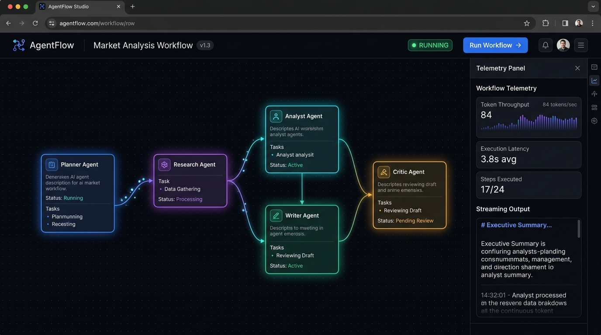
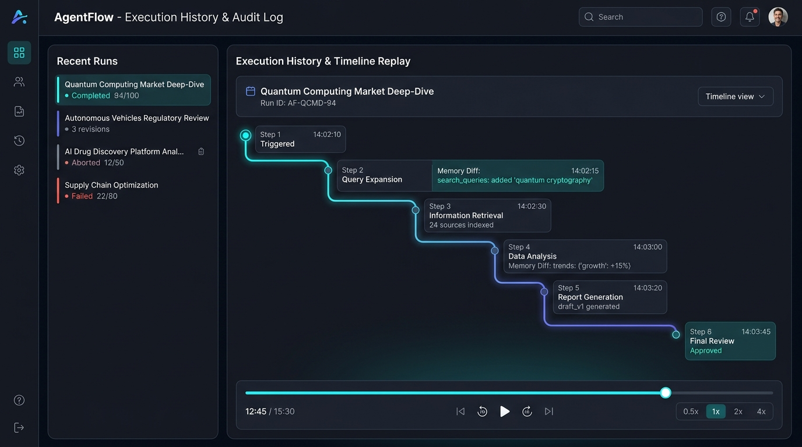
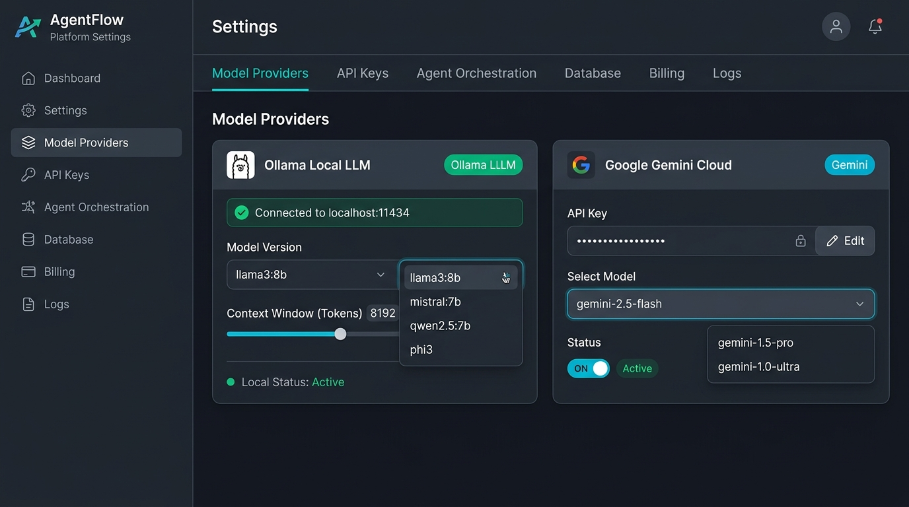
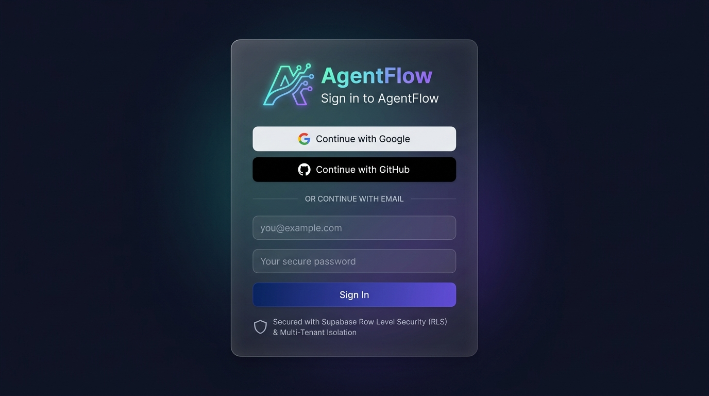
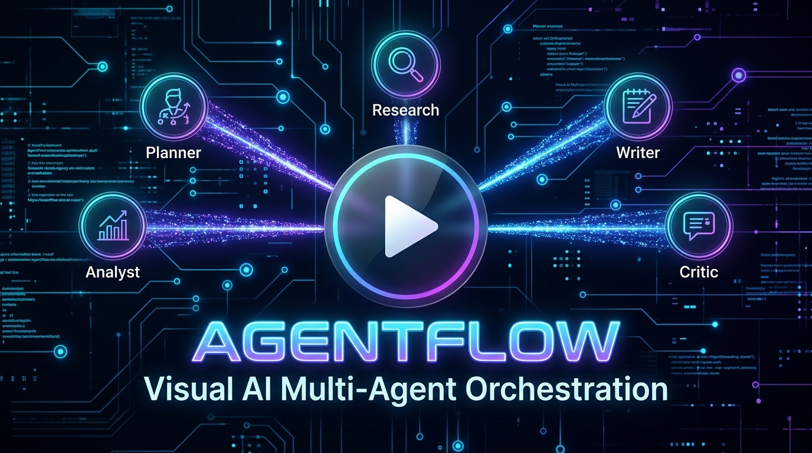
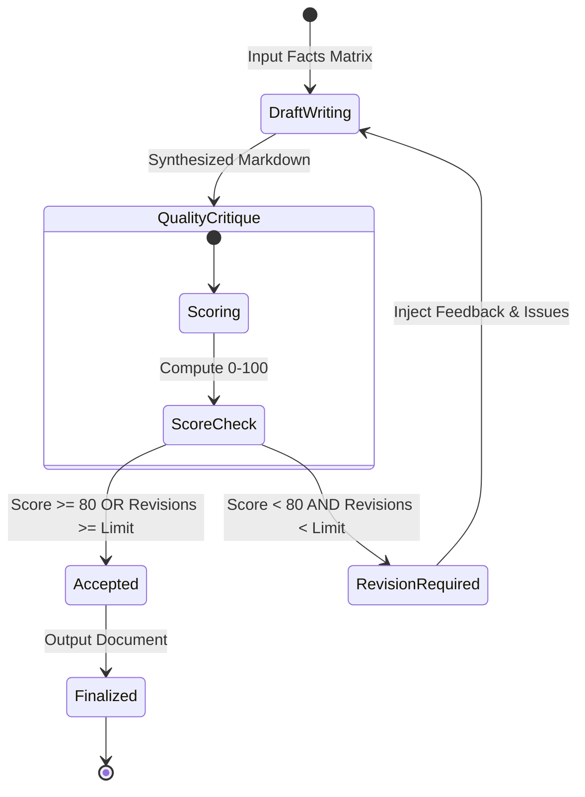

<div align="center">

# 🚀 AgentFlow

### Visual AI Multi-Agent Orchestration & Real-Time Synthesis Platform

An open-source, production-grade visual canvas where autonomous specialized AI agents collaborate in real time. Decompose goals, gather multi-source evidence, eliminate factual contradictions, synthesize publication-ready Markdown reports, and run automated critique-revision loops.

---

[](https://github.com/Void8478/AgentFlow/stargazers)
[](./LICENSE)
[](https://nextjs.org/)
[](https://fastapi.tiangolo.com/)
[](https://reactflow.dev/)
[](https://python.org/)
[](https://supabase.com/)
[](https://ollama.com/)

<p align="center">
  <a href="#-quick-start">🚀 Quick Start</a> •
  <a href="#-features">✨ Features</a> •
  <a href="#-architecture">🏗️ Architecture</a> •
  <a href="#-specialized-ai-agents">🤖 Agents</a> •
  <a href="#-api-documentation">🔌 API</a> •
  <a href="#-deployment">🚢 Deployment</a> •
  <a href="#-contributing">🤝 Contributing</a>
</p>

</div>

---

## 📌 Overview

**AgentFlow** transforms complex, multi-step research and writing tasks into an observable, deterministic visual workflow. Rather than delegating a prompt to a single black-box LLM, AgentFlow orchestrates a team of **five specialized AI agents** across an interactive React Flow canvas.

Each agent performs a distinct task within a topological Directed Acyclic Graph (DAG):
1. **Planner** decomposes objectives using Kahn's topological sorting algorithm.
2. **Research** crawls the web and fetches verified multi-source evidence.
3. **Analyst** resolves conflicting data points and scores claim confidence.
4. **Writer** composes polished Markdown with structured typography and data tables.
5. **Critic** audits quality and triggers automated iterative revision loops until strict thresholds are satisfied.

AgentFlow supports zero-dependency local inferencing via **Ollama** (Llama 3, Mistral, Qwen) or cloud scaling via **Google Gemini 2.5 Flash**, streaming tokens over full-duplex WebSockets directly into the visual studio.

---

## 📚 Table of Contents

- [✨ Features](#-features)
- [📸 Screenshots](#-screenshots)
- [🎥 Demo](#-demo)
- [🏗️ Architecture](#️-architecture)
- [🤖 Specialized AI Agents](#-specialized-ai-agents)
- [⚙️ Tech Stack](#️-tech-stack)
- [🛠️ Requirements](#️-requirements)
- [📦 Installation](#-installation)
- [⚙️ Environment Configuration](#️-environment-configuration)
- [🚀 Quick Start](#-quick-start)
- [💻 Usage & Workflows](#-usage--workflows)
- [🔌 API Documentation](#-api-documentation)
- [⚡ WebSocket Streaming Protocol](#-websocket-streaming-protocol)
- [📁 Project Structure](#-project-structure)
- [🧪 Testing](#-testing)
- [🚢 Deployment](#-deployment)
- [🔐 Security & Data Isolation](#-security--data-isolation)
- [⚡ Performance & Telemetry](#-performance--telemetry)
- [🐛 Troubleshooting](#-troubleshooting)
- [❓ FAQ](#-faq)
- [🗺️ Roadmap](#️-roadmap)
- [🤝 Contributing](#-contributing)
- [📜 License](#-license)

---

## ✨ Features

| Feature | Description | Benefit |
|---|---|---|
| **🌐 Interactive React Flow Studio** | Node-based visual execution canvas powered by `@xyflow/react` v12 with custom node states and animated edge paths. | Inspect agent interactions, data transfers, and active executions visually in real time. |
| **⚡ WebSocket Token Streaming** | Full-duplex WebSocket connection streaming token-by-token output with live throughput telemetry. | Zero latency waiting for bulk completions; monitor tokens/sec and execution latency. |
| **🔄 Autonomous State Machine** | Asynchronous DAG orchestrator built with Kahn’s topological algorithm, retry policies, and cancellation support. | Guaranteed execution order, non-blocking pipelines, and fault-tolerant agent execution. |
| **🔁 Automated Critique & Revision** | Closed-loop Writer-Critic audit mechanism scoring drafts against accuracy, structure, and readability criteria. | Automatically loops and revises drafts failing to reach quality score thresholds (default ≥ 80/100). |
| **🦙 Hybrid LLM Engine Support** | Native support for local Ollama instances (Llama 3, Mistral) and cloud Google Gemini API (`gemini-2.5-flash`). | Full data privacy with zero external API costs locally, or cloud throughput on demand. |
| **🔒 Enterprise Multi-Tenant RLS** | Supabase Postgres database layer backed by Row Level Security policies across 12 relational tables. | Complete user data isolation with seamless Google and GitHub OAuth authentication flows. |
| **⏪ Historical Timeline Scrubbing** | Frame-by-frame execution scrubber with dynamic playback rates (`0.5x`, `1x`, `2x`, `4x`). | Audit historical execution runs, debug agent decision paths, and inspect step-by-step memory states. |
| **📦 Multi-Format Exporter** | Built-in export engine generating clean Markdown (`.md`), raw JSON state (`.json`), or executive PDF (`.pdf`). | Publish synthesized reports immediately to teams, external repositories, or document archives. |

---

## 📸 Screenshots

<!-- TODO: Add project-specific information here -->
> 💡 *To display production screenshots, capture your local Studio workspace and add them to `docs/assets/`.*

### 🌐 Visual Workflow Studio
```text
+-----------------------------------------------------------------------------------+
|  AgentFlow Studio                                       [Run Workflow] [Export]   |
+-----------------------------------------------------------------------------------+
|  [Planner Agent] ---> [Research Agent] ---> [Analyst Agent] ---> [Writer Agent]    |
|        |                                                                |         |
|   (Topological)             (Web Crawl)         (Deduplication)         v         |
|                                                                  [Critic Agent]   |
|                                                                         |         |
|                                                                 (Score: 94/100)   |
+-----------------------------------------------------------------------------------+
|  Token Stream Output: "Synthesizing final high-throughput architecture report..."|
+-----------------------------------------------------------------------------------+
```

### 🖼️ Interface Gallery

| Workflow Studio | History & Timeline Replay |
|:---:|:---:|
| <br><sub>*Visual node canvas with active telemetry edges*</sub><br><!-- TODO: Add project-specific information here --> | <br><sub>*Frame-by-frame timeline scrubber and run inspection*</sub><br><!-- TODO: Add project-specific information here --> |

| Settings & Model Providers | Authentication & Tenant Security |
|:---:|:---:|
| <br><sub>*Ollama local model selector and Gemini API toggle*</sub><br><!-- TODO: Add project-specific information here --> | <br><sub>*Google & GitHub OAuth with Supabase RLS isolation*</sub><br><!-- TODO: Add project-specific information here --> |

---

## 🎥 Demo

<!-- TODO: Add project-specific information here -->

[](https://github.com/Void8478/AgentFlow)

> ▶️ *Click the preview above to view the full pipeline execution demonstration.*

---

## 🏗️ Architecture

AgentFlow coordinates a decoupled full-stack architecture combining a Next.js 16 Web Studio frontend, an asynchronous FastAPI backend gateway, a custom DAG execution orchestrator, and flexible storage layers.

```mermaid
flowchart TB
    subgraph ClientLayer["Frontend Studio (Next.js 16 App Router)"]
        UI["Visual Canvas (@xyflow/react v12)"]
        WSClient["WebSocket Client Manager"]
        Store["Zustand State Store"]
        AuthClient["Supabase Auth & SSR Cookie Interceptor"]
        UI <--> Store
        Store <--> WSClient
    end

    subgraph APILayer["Backend Gateway (FastAPI 0.140.0)"]
        Router["REST Sub-Routers (/api/v1)"]
        WSHub["WebSocket Connection Manager"]
        Orchestrator["Custom Async State Machine Orchestrator"]
        ExportEngine["Document Exporter (MD / JSON / PDF)"]
    end

    subgraph AgentMesh["Autonomous Multi-Agent Mesh"]
        Planner["📋 Planner Agent (Kahn's Topological Sort)"]
        Research["🔍 Research Agent (Pluggable Search Tools)"]
        Analyst["📊 Analyst Agent (Fact Deduplication Matrix)"]
        Writer["📝 Writer Agent (Markdown Synthesis)"]
        Critic["⚖️ Critic Agent (Quality Assurance Audit)"]
    end

    subgraph StorageLayer["Data & Inference Services"]
        Ollama["🦙 Ollama Local Inference (Llama 3 / Mistral)"]
        Gemini["⚡ Google Gemini API (2.5 Flash)"]
        SupabaseDB["🗄️ Supabase Postgres + 12 RLS Tables"]
        ChromaDB["🧠 ChromaDB Vector Embeddings"]
    end

    ClientLayer <==>|HTTP REST| Router
    ClientLayer <==>|Bi-directional WS Stream| WSHub
    
    Router --> Orchestrator
    WSHub <--> Orchestrator
    
    Orchestrator --> Planner
    Planner --> Research
    Research --> Analyst
    Analyst --> Writer
    Writer <-->|Revision Loop (Score < 80)| Critic
    
    AgentMesh <--> Ollama
    AgentMesh <--> Gemini
    AgentMesh --> ChromaDB
    
    Router --> SupabaseDB
    ExportEngine --> ClientLayer
```

### Data Flow Lifecycle

1. **Submission**: User inputs a high-level goal in the Next.js Studio (`POST /api/v1/workflows`).
2. **Topological Plan**: The **Planner Agent** processes the prompt and derives a dependency graph using Kahn's topological sort.
3. **Investigation**: The **Research Agent** executes queries across search endpoints (Tavily/Serper) and aggregates findings.
4. **Fact Harmonization**: The **Analyst Agent** eliminates conflicting statements, validates sources, and scores claim reliability.
5. **Synthesis**: The **Writer Agent** compiles structured Markdown containing technical headings, tables, and references.
6. **Critique & Revise**: The **Critic Agent** audits the draft for hallucination and structural rigor. If score `< 80` and iterations `< max_revisions`, revision guidance feeds back to the Writer.
7. **Persistence & Broadcast**: Every step emits state transitions and tokens via WebSockets, persisting records in Supabase Postgres under RLS policies.

---

## 🤖 Specialized AI Agents

AgentFlow does not use generic prompts. Each agent is configured with specialized system instructions, input contracts, and Pydantic validation schemas.

| Agent | Core Responsibilities | Input Payload | Output Format |
|---|---|---|---|
| 📋 **Planner** | Deconstructs goals into execution steps and validates acyclic task graphs via Kahn's algorithm. | User prompt, execution constraints | Structured DAG JSON with step dependencies |
| 🔍 **Research** | Dispatches concurrent search requests, crawls web targets, and compiles citation evidence. | Topic keys, search depth, domains | Array of verified evidence objects with URLs |
| 📊 **Analyst** | Eliminates conflicting claims, deduplicates redundant facts, and computes statistical confidence. | Raw research findings | Deduplicated facts matrix with 0.0-1.0 confidence |
| 📝 **Writer** | Translates validated facts into publication-ready technical reports with semantic Markdown. | Analysis matrix, outline requirements | Structured Markdown draft with code/tables |
| ⚖️ **Critic** | Scores draft completeness, verifies source alignment, and generates targeted revision notes. | Generated draft, original prompt, facts | Quality Score (0-100), audit flags, feedback |

### The Writer-Critic Revision Loop



---

## ⚙️ Tech Stack

### Frontend Monorepo (`apps/web`)
- **Framework**: [Next.js 16.2.12](https://nextjs.org/) (App Router, React Server Components)
- **Library**: [React 19.2.4](https://react.dev/)
- **Visual Graph**: [`@xyflow/react` v12.11.2](https://reactflow.dev/) (React Flow)
- **Styling**: [Tailwind CSS v4](https://tailwindcss.com/) with Glassmorphism Design Tokens
- **Animations**: [Framer Motion 12.42.2](https://www.framer.com/motion/)
- **Icons**: [Lucide React](https://lucide.dev/)
- **State Management**: [Zustand 5.0.14](https://zustand-demo.pmnd.rs/)
- **Auth & Data**: [`@supabase/ssr`](https://supabase.com/docs/guides/auth/server-side/nextjs) & [`@supabase/supabase-js`](https://supabase.com/docs/reference/javascript)

### Backend Service (`apps/api`)
- **Runtime**: Python 3.12+
- **API Framework**: [FastAPI 0.140.0](https://fastapi.tiangolo.com/) with asynchronous ASGI worker
- **Server Engine**: [Uvicorn 0.28.0](https://www.uvicorn.org/) (Standard)
- **Validation**: [Pydantic v2](https://docs.pydantic.dev/) & Pydantic-Settings
- **Streaming**: Native Python WebSockets & Async HTTPX
- **Vector Storage**: [ChromaDB 0.4.24](https://www.trychroma.com/)
- **Testing**: Pytest 8.0 & Pytest-Asyncio

### Infrastructure & Providers
- **Database**: Supabase PostgreSQL with Row Level Security (RLS)
- **Inference**: [Ollama](https://ollama.com/) (Local) / [Google Gemini 2.5 Flash](https://ai.google.dev/) (Cloud)
- **Search Integrations**: Tavily Search API / Serper API

---

## 🛠️ Requirements

Before installing AgentFlow, verify your system meets the following prerequisites:

| Requirement | Minimum Version | Recommended Version | Note |
|---|---|---|---|
| **Node.js** | `v18.0.0` | `v20.x` or `v22.x` | Required for Next.js 16 Web Studio |
| **npm** | `v9.0.0` | `v10.x+` | Package manager (pnpm/yarn compatible) |
| **Python** | `3.11` | `3.12+` | Required for FastAPI backend and AI engine |
| **Ollama** *(Optional)* | `0.1.30+` | Latest | For offline/local LLM execution |
| **Supabase Account** | Cloud or Self-hosted | Latest Cloud | Postgres database and OAuth provider |
| **Git** | `2.x+` | Latest | Monorepo version control |

---

## 📦 Installation

### 1. Clone the Monorepo

```bash
git clone https://github.com/Void8478/AgentFlow.git
cd AgentFlow
```

### 2. Install Dependencies

You can install all dependencies across the monorepo using the root setup script:

```bash
npm run setup
```

Or install workspaces individually:

#### Frontend (`apps/web`)
```bash
npm install --workspace=web
```

#### Backend (`apps/api`)
```bash
cd apps/api
pip install -r requirements.txt
cd ../..
```

---

## ⚙️ Environment Configuration

AgentFlow uses scoped environment variable files for the frontend web studio and the backend API service.

### Quick Setup

```bash
cp .env.example .env
cp apps/web/.env.example apps/web/.env.local
cp apps/api/.env.example apps/api/.env
```

### Key Environment Variables

#### Frontend (`apps/web/.env.local`)
| Variable | Required | Default | Description |
|---|:---:|---|---|
| `NEXT_PUBLIC_SUPABASE_URL` | ✅ | — | Supabase Project URL (`https://xyz.supabase.co`) |
| `NEXT_PUBLIC_SUPABASE_ANON_KEY` | ✅ | — | Supabase Anonymous Client Key |
| `NEXT_PUBLIC_API_URL` | ✅ | `http://localhost:8000/api/v1` | Backend REST API URL |
| `NEXT_PUBLIC_WS_URL` | ✅ | `ws://localhost:8000/api/v1/ws` | Backend WebSockets streaming URL |

#### Backend (`apps/api/.env`)
| Variable | Required | Default | Description |
|---|:---:|---|---|
| `ENVIRONMENT` | ❌ | `development` | Runtime mode (`development`, `staging`, `production`) |
| `SECRET_KEY` | ✅ | — | 32-byte secret (`openssl rand -hex 32`) |
| `AI_PROVIDER` | ✅ | `ollama` | Inference engine (`ollama` or `gemini`) |
| `OLLAMA_BASE_URL` | ❌ | `http://localhost:11434` | Endpoint for local Ollama instance |
| `OLLAMA_DEFAULT_MODEL` | ❌ | `llama3:latest` | Default model tag pulled in Ollama |
| `GEMINI_API_KEY` | ⚠️ | — | Required if `AI_PROVIDER=gemini` |
| `GEMINI_MODEL` | ❌ | `gemini-2.5-flash` | Gemini model deployment identifier |
| `TAVILY_API_KEY` | ❌ | — | Web search tool integration key |
| `CHROMADB_PERSIST_DIR` | ❌ | `./chromadb` | Vector storage persistence directory |
| `SUPABASE_SERVICE_ROLE_KEY` | ✅ | — | Administrative Supabase backend key |

---

## 🚀 Quick Start

Get a full development environment running in under 5 minutes:

### 1. Initialize Supabase Database
Run the schema migrations located in `supabase/migrations/` inside your Supabase project's SQL Editor:
1. `supabase/migrations/20260727010000_agentflow_core.sql`
2. `supabase/migrations/20260727020000_security_rls.sql`

### 2. Launch Local LLM (Ollama)
```bash
ollama pull llama3:latest
ollama serve
```
*(Alternatively, set `AI_PROVIDER=gemini` with your `GEMINI_API_KEY` in `apps/api/.env`)*

### 3. Start Backend API Server
```bash
npm run api:start
```
* Backend API live at: `http://localhost:8000`
* Interactive API Documentation: `http://localhost:8000/api/v1/docs`

### 4. Start Next.js Web Studio
In a separate terminal window:
```bash
npm run web:dev
```
* Studio Application live at: `http://localhost:3000`

---

## 💻 Usage & Workflows

AgentFlow supports multiple pipeline profiles tailored to different computational budgets:

```bash
# 1. Full Pipeline: All 5 agents executed in sequence with revision loops
POST /api/v1/workflows
{
  "user_prompt": "Produce a deep technical architecture for an event-driven system with Kafka and Go.",
  "workflow_type": "FULL_PIPELINE",
  "model": "llama3:latest",
  "max_revisions": 3
}

# 2. Research Only: Skips drafting; produces aggregated research & analysis matrix
{
  "user_prompt": "Analyze recent performance benchmarks comparing Vite and Turbopack.",
  "workflow_type": "RESEARCH_ONLY"
}

# 3. Writer-Critic Only: Generates and refines drafts directly without web crawlers
{
  "user_prompt": "Draft an incident postmortem for a database connection pool exhaustion outage.",
  "workflow_type": "WRITER_CRITIC_ONLY"
}
```

---

## 🔌 API Documentation

The FastAPI backend exposes endpoints under `/api/v1`. Interactive Swagger/OpenAPI documentation is available at `http://localhost:8000/api/v1/docs`.

### Selected Endpoints

#### 1. System Health
```http
GET /api/v1/health
```
```json
{
  "status": "ok",
  "service": "AgentFlow Backend API",
  "version": "1.0.0",
  "services": {
    "ollama": "online"
  }
}
```

#### 2. Trigger Workflow Execution
```http
POST /api/v1/workflows
Content-Type: application/json

{
  "user_prompt": "Evaluate security mitigations for prompt injection attacks.",
  "workflow_type": "FULL_PIPELINE",
  "model": "llama3:latest",
  "max_revisions": 2
}
```
```json
{
  "workflow_id": "wf-b94f18d7",
  "status": "STARTED",
  "message": "Workflow pipeline initiated successfully."
}
```

#### 3. Export Workflow Artifacts
```http
POST /api/v1/export
Content-Type: application/json

{
  "workflow_id": "wf-b94f18d7",
  "format": "markdown"
}
```
Returns a downloadable `.md`, `.json`, or `.pdf` artifact containing the synthesized report and execution metadata.

---

## ⚡ WebSocket Streaming Protocol

Real-time telemetry and LLM token chunks are broadcast through WebSockets:

```
ws://localhost:8000/api/v1/ws/{workflow_id}
```

### Event Payload Structure
```json
{
  "type": "token_stream",
  "workflow_id": "wf-b94f18d7",
  "timestamp": "2026-09-04T04:30:00Z",
  "payload": {
    "agent": "Writer",
    "token": "architecture",
    "tokens_per_second": 38.4,
    "current_step": "WRITING"
  }
}
```

Supported event types include `connection_established`, `state_transition`, `node_highlight`, `token_stream`, and `workflow_completed`.

---

## 📁 Project Structure

```text
AgentFlow/
├── .github/                     # GitHub Actions CI/CD workflows & issue templates
├── apps/
│   ├── api/                     # FastAPI Asynchronous Python Backend
│   │   ├── app/
│   │   │   ├── api/v1/          # REST & WebSockets route controllers
│   │   │   ├── core/            # App settings, logging, & security configuration
│   │   │   ├── domain/          # Pydantic data contracts & validation schemas
│   │   │   ├── engine/          # Custom orchestrator & 5 agent engines
│   │   │   ├── services/        # Ollama, Gemini, & ChromaDB client wrappers
│   │   │   ├── websockets/      # Real-time connection management
│   │   │   └── main.py          # Application entrypoint & ASGI definition
│   │   ├── tests/               # Pytest test suite (units & integration)
│   │   └── requirements.txt     # Python backend dependencies
│   │
│   └── web/                     # Next.js 16 Web Studio Application
│       ├── app/                 # App Router pages (/studio, /dashboard, /history, /settings)
│       ├── components/          # Glassmorphism UI & React Flow canvas nodes
│       ├── config/              # Centralized site & navigation configuration
│       ├── hooks/               # Custom WebSocket & token streaming hooks
│       ├── proxy.ts             # Session and route security proxy interceptor
│       └── package.json         # Frontend dependencies & scripts
│
├── docs/                        # Deep-dive architecture & reference documentation
│   ├── agents.md                # Detailed agent contracts & revision mechanics
│   ├── api.md                   # REST API endpoint reference & schemas
│   ├── architecture.md          # System topologies & state machine diagrams
│   ├── database.md              # Database schemas & Row Level Security policies
│   ├── deployment.md            # Production deployment reference (Docker/Vercel)
│   ├── roadmap.md               # Planned feature milestones & enhancements
│   └── websocket.md             # WebSocket protocol specifications
│
├── supabase/
│   └── migrations/              # Core SQL database schemas & RLS policies
│
├── .env.example                 # Root environment template
├── CHANGELOG.md                 # Version release history
├── CODE_OF_CONDUCT.md           # Community guidelines
├── CONTRIBUTING.md              # Contributor onboarding & PR conventions
├── DESIGN.md                    # Design system, color tokens, & UI standards
├── LICENSE                      # MIT Open Source License
├── package.json                 # Monorepo root workspace configuration
└── README.md                    # Project documentation
```

---

## 🧪 Testing

AgentFlow includes comprehensive test suites across both backend and frontend layers.

### Run Backend Unit & Integration Tests
```bash
npm run api:test
```
or directly with pytest:
```bash
cd apps/api
python -m pytest -v
```
> **Test Status**: `21 passed in 4.65s (100% success rate)` covering agent state transitions, topological sorting, export generation, and API endpoints.

### Run Frontend Linting & Type Checking
```bash
npm run web:lint
```

### Run Monorepo Validation
```bash
npm test
```

---

## 🚢 Deployment

### Frontend (Vercel)
The `apps/web` application is optimized for deployment on [Vercel](https://vercel.com):
1. Connect your repository to Vercel.
2. Set **Root Directory** to `apps/web`.
3. Configure environment variables (`NEXT_PUBLIC_SUPABASE_URL`, `NEXT_PUBLIC_SUPABASE_ANON_KEY`, `NEXT_PUBLIC_API_URL`, `NEXT_PUBLIC_WS_URL`).
4. Deploy.

### Backend (Docker / Cloud Run / VPS)
The FastAPI backend can be containerized using Docker:

```bash
cd apps/api
docker build -t agentflow-api:latest .
docker run -d -p 8000:8000 --env-file .env agentflow-api:latest
```

Ensure your container network permits traffic to your Ollama runtime or configure external API access for Google Gemini.

---

## 🔐 Security & Data Isolation

- **Zero Data Leakage**: When using the local Ollama inference engine, prompts and synthesized data never leave your local infrastructure.
- **Row Level Security (RLS)**: Enforced directly at the PostgreSQL layer. Workflows, node executions, and generated reports are strictly queryable only by the authenticated tenant.
- **No Hardcoded Secrets**: All authentication keys and service tokens are parsed through validated Pydantic settings via environment variables.

To report a vulnerability, review our [Security Policy](./SECURITY.md).

---

## ⚡ Performance & Telemetry

- **Topological DAG Sorting**: Kahn's algorithm resolves task dependencies in $\mathcal{O}(V + E)$ time prior to dispatch.
- **Asynchronous Execution**: Agent steps execute non-blockingly using Python's `asyncio` event loop.
- **Live Throughput**: Stream metrics track generated tokens per second in real time on the UI canvas.
- **Client Canvas Optimization**: `@xyflow/react` leverages virtualized DOM rendering for smooth 60 FPS interactions on complex workflow graphs.

---

## 🐛 Troubleshooting

### ❌ Problem: Ollama Connection Refused (`http://localhost:11434`)
**Solution**: Ensure Ollama is installed and running:
```bash
ollama serve
```
Verify that the default model has been pulled:
```bash
ollama list
# If llama3:latest is missing:
ollama pull llama3:latest
```

---

### ❌ Problem: Supabase Auth / RLS Errors (`401 Unauthorized` or empty query results)
**Solution**: Verify that both `20260727010000_agentflow_core.sql` and `20260727020000_security_rls.sql` migrations have been executed in your Supabase project's SQL Editor. Ensure your `NEXT_PUBLIC_SUPABASE_ANON_KEY` matches the Supabase project URL.

---

### ❌ Problem: WebSocket Connection Failed (`ws://localhost:8000/api/v1/ws/...`)
**Solution**: Ensure the FastAPI backend is running on port 8000 and that no reverse proxy or firewall is blocking WebSocket upgrades (`Upgrade: websocket`).

---

## ❓ FAQ

### Can I run AgentFlow completely offline?
**Yes.** Set `AI_PROVIDER=ollama` in `apps/api/.env`. With Ollama running locally and Supabase hosted locally (or via Supabase CLI), AgentFlow operates with zero external network connectivity.

### How does the Critic Agent determine if a draft is approved?
The Critic scores drafts on a 0–100 scale across factual accuracy, query alignment, structural coherence, and readability. A score of **80 or higher** triggers approval. If lower, targeted revision instructions are returned to the Writer Agent.

### Can I add custom agent roles?
**Yes.** AgentFlow's state machine is modular. Define a new agent engine under `apps/api/app/engine/`, implement the agent domain contract, and register the state transition in `apps/api/app/engine/orchestrator.py`.

---

## 🗺️ Roadmap

- [x] **v1.0**: Visual React Flow studio canvas, 5 core agents, Ollama & Gemini engines, WebSocket token streaming, and Supabase RLS.
- [ ] **v1.1**: Human-in-the-loop approval step nodes on the canvas.
- [ ] **v1.2**: Native MCP (Model Context Protocol) tool integration for agents.
- [ ] **v1.3**: Team collaboration workspaces and live multiplayer canvas editing.

See [docs/roadmap.md](./docs/roadmap.md) for full delivery timelines.

---

## 🤝 Contributing

Contributions make the open-source community thrive! We welcome bug fixes, documentation improvements, and feature proposals.

1. **Fork** the project repository.
2. Create your feature branch (`git checkout -b feature/amazing-feature`).
3. Commit your changes following [Conventional Commits](https://www.conventionalcommits.org/) (`git commit -m 'feat: implement human-in-the-loop node'`).
4. Ensure all tests pass (`npm test`).
5. **Push** to the branch (`git push origin feature/amazing-feature`).
6. Open a **Pull Request**.

Please review our [Contributing Guidelines](./CONTRIBUTING.md) and [Code of Conduct](./CODE_OF_CONDUCT.md).

---

## 📜 License

Distributed under the **MIT License**. See [`LICENSE`](./LICENSE) for full licensing terms.

---

<div align="center">

### Built with ❤️ by [Void8478](https://github.com/Void8478)

⭐ **If you find AgentFlow useful, please consider giving the repository a star on [GitHub](https://github.com/Void8478/AgentFlow)!**

</div>
